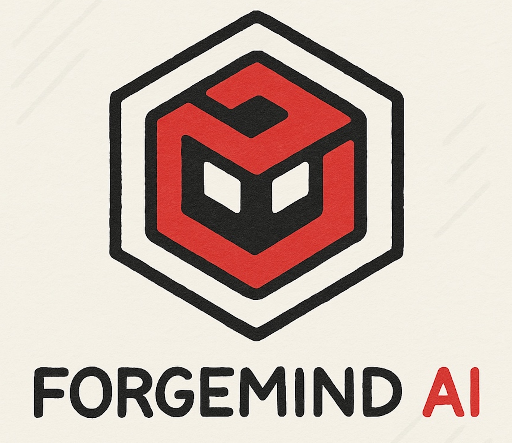
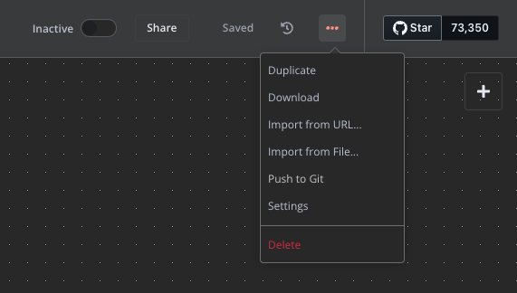

  

# ForgeMindAI

This repository is part of the [ForgeMindAI](https://www.youtube.com/@ForgeMindAI) YouTube channel, where we explore practical AI automation tools and workflows. You'll find a sample **n8n workflow** to kickstart your AI-powered automation.

## 🛠️ What's Included

- A pre-built n8n workflow to help you get started fast  
- Easy-to-follow instructions and video walkthroughs

## 🎥 Watch the Tutorial

Check out the full tutorial on the ForgeMindAI YouTube channel: [[YouTube Link Here](https://youtu.be/ZqWQwbzvrac)]

## To import the workflow to your n8n
* Go to the 3 dots in the top right corner after creating a workflow.
* Select import from file and select this file. (Gmail_Classifier.json)
  

For any queries on this repo, contact us on the following social handles:
Youtube: https://www.youtube.com/@forgemindai
Instagram: https://www.instagram.com/forgemind_ai/reels/

If you like this repo, star it and follow us for more exciting public repos.
